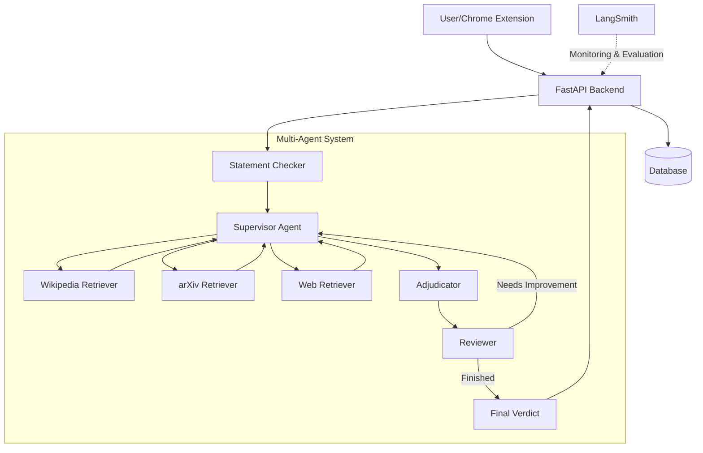

# 🦊 Foxcheck

[](https://fastapi.tiangolo.com/)
[](https://www.python.org/)
[](https://langchain.com/)
[](https://openai.com/)

🔍 A sophisticated fact-checking platform that uses AI to verify statements through multi-agent collaboration, powered by Large Language Models.

## 🌟 Overview

Foxcheck is an asynchronous application built with FastAPI that validates and verifies statements using a multi-agent system powered by Large Language Models (LLMs). The platform employs a sophisticated orchestration of agents that search multiple sources (Wikipedia, arXiv, web) to gather evidence, analyze the information, and render verdicts on statement accuracy.

The system is designed for journalists, researchers, and anyone seeking to verify factual claims with a rigorous, evidence-based approach. Foxcheck not only provides verdicts (True, Mostly True, Uncertain, Mostly False, False) but also delivers comprehensive explanations with references to support its conclusions.

## 🏗️ Architecture



## ✨ Key Features

- **🤖 Multi-Agent Fact-Checking**: Employs a collaborative system of specialized agents that work together to verify statements:
  - Supervisor Agent: Coordinates the fact-checking process
  - Research Agents: Search Wikipedia, arXiv, and the web for relevant information
  - Adjudicator: Analyzes gathered evidence and renders a verdict
  - Reviewer: Ensures the verdict meets quality standards

- **🔍 Statement Verification**: Provides nuanced verdicts (True, Mostly True, Uncertain, Mostly False, False) with detailed explanations and references.

- **📊 LLM Orchestration**: Uses LangChain and LangGraph for sophisticated workflows that enable multi-hop reasoning and iterative research.

- **📈 Live Tracing and Monitoring**: Integrates LangSmith for real-time tracing and monitoring of LLM performance.

- **🧪 Experimentation and Evaluation**: Supports building datasets, defining metrics, and conducting experiments to evaluate and improve fact-checking accuracy.

- **🔐 User Authentication**: Provides secure user registration and login using JWT tokens.

- **🌐 Chrome Extension**: Browser extension that extracts article content from news sites (NYT, Substack) for fact-checking.

## 🔄 How It Works

1. **Statement Input**: Users submit statements for verification through the API or Chrome extension.

2. **Multi-Agent Processing**:
   - The Supervisor Agent analyzes the statement and determines what information is needed
   - Research Agents search multiple sources (Wikipedia, arXiv, web) to gather relevant evidence
   - The system may perform multiple research iterations (multi-hop) to find more specific information
   - The Adjudicator analyzes all gathered evidence and renders a verdict with explanation
   - The Reviewer ensures the verdict is well-supported and may request additional research if needed

3. **Verdict Delivery**: The system returns a final verdict with:
   - Accuracy rating (True, Mostly True, Uncertain, Mostly False, False)
   - Detailed explanation of the reasoning
   - References to support the conclusion

## 🛠️ Technologies and Tools

- **[FastAPI](https://fastapi.tiangolo.com/)**: Modern, high-performance web framework for building APIs with Python
- **[SQLModel](https://sqlmodel.tiangolo.com/)**: ORM for handling database operations with type safety
- **[LangChain](https://langchain.com/)**: Framework for developing applications powered by LLMs
- **[LangGraph](https://github.com/langchain-ai/langgraph)**: Library for building stateful, multi-agent workflows
- **[LangSmith](https://smith.langchain.com/)**: Platform for debugging, testing, and monitoring LLM applications
- **[Pydantic](https://pydantic-docs.helpmanual.io/)**: Data validation and settings management
- **[JWT Authentication](https://jwt.io/)**: Secure user authentication and authorization
- **[OpenAI GPT-4](https://openai.com/)**: Advanced language model for statement analysis
- **[Tavily](https://tavily.com/)**: AI search engine for web retrieval
- **[JavaScript, HTML, CSS](https://developer.mozilla.org/)**: For the Chrome extension and front-end components

## 📂 Project Structure

The repository is organized into the following main directories:

- **`agents/`**: Contains the multi-agent system implementation for statement checking
- **`chainlit/`**: Integrations for visualizing experimental chains
- **`chains/`**: Contains the LangChain chains responsible for LLM orchestration
- **`chrome_extension/`**: Code for the Chrome extension that extracts articles from news sites
- **`dspy/`**: Data processing scripts and optimization utilities
- **`evaluation/`**: Scripts and methods for evaluating experiments using LangSmith
- **`experiments/`**: Configurations and scripts for running fact-checking experiments
- **`routers/`**: API route definitions for the FastAPI application
- **`static/`** and **`templates/`**: Front-end assets for the web interface

## 🚀 Getting Started

### Prerequisites

- **Python 3.7+**
- **Docker** (optional for containerization)
- **Nix** (for managing dependencies, if desired)
- **API Keys** for OpenAI, Tavily, and LangSmith

### Installation

1. **Clone the repository**

   ```bash
   git clone https://github.com/ledgerW/foxcheck.git
   cd foxcheck
   ```

2. **Create a virtual environment and install dependencies**

   ```bash
   python3 -m venv venv
   source venv/bin/activate
   pip install -r requirements.txt
   ```

3. **Set up environment variables**

   Create a `.env` file in the project root with the following variables:

   ```
   # Database
   DATABASE_URL=sqlite:///./foxcheck.db
   
   # Authentication
   SECRET_KEY=your_secret_key
   ALGORITHM=HS256
   ACCESS_TOKEN_EXPIRE_MINUTES=30
   
   # API Keys
   OPENAI_API_KEY=your_openai_api_key
   TAVILY_API_KEY=your_tavily_api_key
   
   # LangSmith (for tracing)
   LANGCHAIN_API_KEY=your_langchain_api_key
   LANGCHAIN_PROJECT=foxcheck
   LANGCHAIN_TRACING_V2=true
   ```

4. **Run the Application**

   ```bash
   uvicorn main:app --reload
   ```

   This will start the FastAPI server on `http://127.0.0.1:8000`.

5. **Access API Documentation**

   Open a browser and navigate to `http://127.0.0.1:8000/docs` to explore the API documentation generated by FastAPI.

6. **Optional: Using Docker**

   Build and run the Docker container:

   ```bash
   docker build -t foxcheck .
   docker run -p 8000:8000 foxcheck
   ```

## 🌐 Chrome Extension

The Chrome extension allows users to extract content from news articles for fact-checking:

1. **Installation**:
   - Navigate to `chrome://extensions` in your browser
   - Enable "Developer mode" and click "Load unpacked"
   - Select the `chrome_extension` directory from the project

2. **Usage**:
   - Navigate to a supported news site (currently NYT or Substack)
   - Click the Foxcheck extension icon in your browser
   - Log in with your Foxcheck credentials
   - Click "Extract Article" to send the article content to Foxcheck for analysis

## 🤝 Contributing

Contributions are welcome! Here's how you can contribute:

1. Fork the repository
2. Create a feature branch (`git checkout -b feature/amazing-feature`)
3. Commit your changes (`git commit -m 'Add some amazing feature'`)
4. Push to the branch (`git push origin feature/amazing-feature`)
5. Open a Pull Request

## 📄 License

This project is licensed under the MIT License - see the LICENSE file for details.

---

Built with ❤️ using [LangChain](https://langchain.com/), [FastAPI](https://fastapi.tiangolo.com/), and [OpenAI](https://openai.com/).
